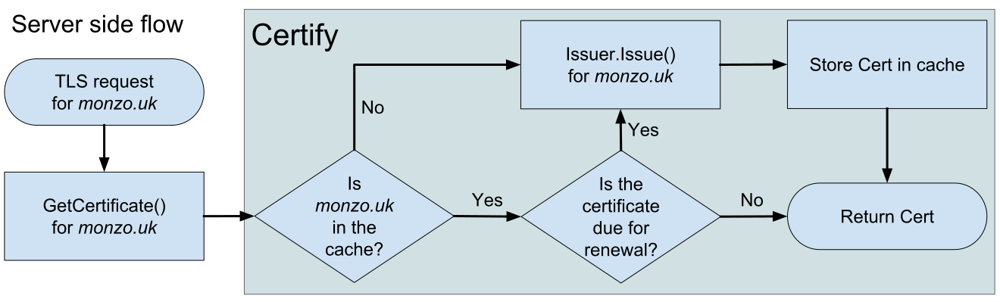

# Certify

[](https://circleci.com/gh/johanbrandhorst/certify)
[](https://godoc.org/github.com/johanbrandhorst/certify)
[](https://goreportcard.com/report/github.com/johanbrandhorst/certify)
[](https://codecov.io/gh/johanbrandhorst/certify)
[](https://github.com/johanbrandhorst/certify/releases)
[](LICENSE)
[](https://gitter.im/go-certify/community)


Certify allows easy automatic certificate distribution and maintenance.
Certificates are requested as TLS connections
are made, courtesy of the `GetCertificate` and `GetClientCertificate`
`tls.Config` hooks. Certificates are optionally cached. Simultaneous requests
are deduplicated to minimize pressure on issuers.

## Vault walkthrough

My presentation from [GolangPiter 2019](https://golangpiter.com/en/materials/2646)
contains a walkthrough of how to configure your Vault instance to securely issue
certificates for your Go clients and servers.

[](https://www.youtube.com/watch?v=boG7BSRaJ9E)

## Users

- [Georgetown University](https://www.georgetown.edu/)

Are you using Certify and want to be visible here? Open an issue!

## Issuers

Certify exposes an `Issuer` interface which is used to allow switching
between issuer backends.

Currently implemented issuers:

- [Vault PKI Secrets Engine](https://vaultproject.io)
- [Cloudflare CFSSL Certificate Authority](https://cfssl.org/)
- [AWS Certificate Manager Private Certificate Authority](https://aws.amazon.com/certificate-manager/private-certificate-authority/)

## Usage

Create an issuer:

```go
issuer := &vault.Issuer{
    URL: &url.URL{
        Scheme: "https",
        Host: "my-local-vault-instance.com",
    },
    Token:     "myVaultToken",
    Role:      "myVaultRole",
}
```

Create a Certify:

```go
c := &certify.Certify{
    // Used when request client-side certificates and
    // added to SANs or IPSANs depending on format.
    CommonName: "MyServer.com",
    Issuer: issuer,
    // It is recommended to use a cache.
    Cache: certify.NewMemCache(),
    // It is recommended to set RenewBefore.
    // Refresh cached certificates when < 24H left before expiry.
    RenewBefore: 24*time.Hour,
}
```

Use in your TLS Config:

```go
tlsConfig := &tls.Config{
    GetCertificate: c.GetCertificate,
}
```

That's it! Both server-side and client-side certificates
can be generated:

```go
tlsConfig := &tls.Config{
    GetClientCertificate: c.GetClientCertificate,
}
```

For an end-to-end example using gRPC with mutual TLS authentication,
see the [Vault tests](./issuers/vault/vault_test.go).

## Docker image (sidecar model)

If you really want to use Certify but you are not able to use Go, there is
now a [Docker image](https://hub.docker.com/r/jfbrandhorst/certify) available!

Simply configure this image as the access point for your Kubernetes pod and
let it proxy traffic to your server.

## How does it work?



Certify hooks into the `GetCertificate` and `GetClientCertificate` methods of
the Go TLS stack `Config` struct. These get called when the server/client
respectively is required to present its certificate. If possible, this is
fetched from the cache, based on the requested server name. If not, a new
certificate is issued with the requested server name present. For client
requests, the configured `CommonName` is used.
